# uart_test — Linux UART Interface for RISC-V Firmware Validation

A C program that opens, configures, and communicates over a UART serial interface on Linux. Built as part of the **LFX Mentorship Challenge: RISC-V ACT Framework Enablement and M-Mode Firmware Validation on Hardware Board**.

---

## What does this program actually do?

When you plug a RISC-V development board into your Linux machine, the board shows up as a device like `/dev/ttyUSB0`. This program opens that connection, sets the right communication speed and format, sends a test message to the board, and reads back whatever the board responds with — printing everything as both readable text and raw hex bytes so you can debug exactly what's happening at the byte level.

Think of it as a minimal, debugger-friendly terminal for RISC-V firmware over UART.

## How it works

### The physical connection

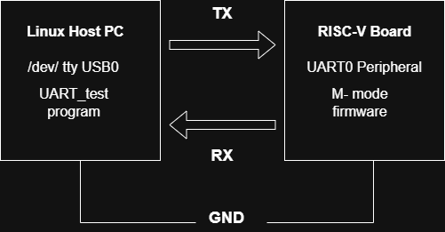

Your Linux machine talks to the RISC-V board over three wires — TX (transmit), RX (receive), and GND (ground). A USB-to-serial adapter on your PC converts USB signals into the simple voltage pulses UART uses. The board shows up as `/dev/ttyUSB0` and this program speaks to it directly.

---

### Program flow

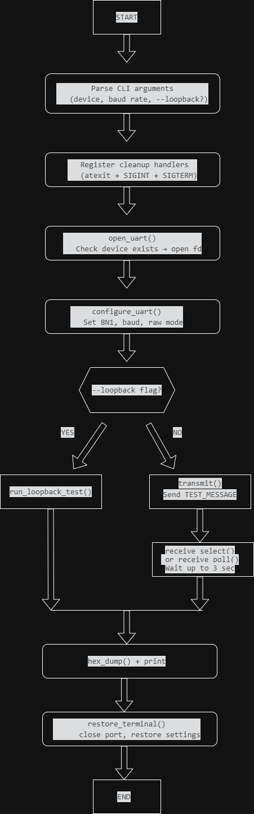

The program opens the port, locks in the baud rate and 8N1 settings, then either runs a loopback self-test (if you passed `--loopback`) or transmits the test message and waits up to 3 seconds for a response. Either way, cleanup always runs on exit — even if you hit Ctrl+C.

---

### What a single byte looks like on the wire (8N1 frame)

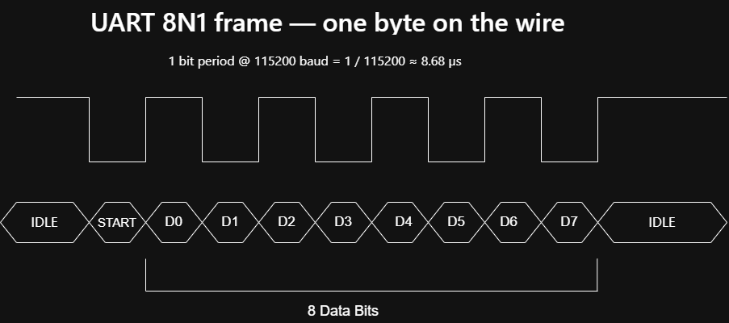

Every byte sent over UART is wrapped in a frame. The line sits HIGH when idle. A START bit (LOW) tells the receiver "a byte is coming." Then 8 data bits arrive one at a time, LSB first. A STOP bit (HIGH) closes the frame. No parity bit is added — that's what the **N** in 8N1 means. At 115200 baud, each bit lasts about 8.68 microseconds.

---

## Features

| Feature | Details |
|---|---|
| Configurable baud rate | CLI argument, supports 1200 → 921600 bps |
| 8N1 serial format | 8 data bits, no parity, 1 stop bit |
| Non-blocking receive | `select()` by default, `poll()` via compile flag |
| Loopback self-test | `--loopback` flag verifies TX == RX byte-for-byte |
| Hex + ASCII dump | See every received byte, including non-printable ones |
| Graceful cleanup | `atexit()` + SIGINT/SIGTERM restores terminal always |
| Rich error messages | Exact fix commands for common errors (permissions, missing device) |

---

## Supported Baud Rates

| Rate | Use case |
|---|---|
| 9600 | Slow legacy devices |
| 115200 | Standard for most RISC-V boards |
| 230400 | High-speed firmware logging |
| 460800 | ACT result streaming |
| 921600 | Maximum for most USB-serial adapters |

---

## Build

**Default build (uses `select()`):**
```bash
make
```

**Build with `poll()` instead of `select()`:**
```bash
make poll
```

**Manual build without Makefile:**
```bash
gcc -Wall -Wextra -o uart_test uart_test.c
# or with poll():
gcc -Wall -Wextra -DUSE_POLL -o uart_test uart_test.c
```

---

## Run

**Basic usage — talk to a real board:**
```bash
./uart_test /dev/ttyUSB0 115200
```

**With loopback self-test (TX pin jumpered to RX pin):**
```bash
./uart_test /dev/ttyUSB0 115200 --loopback
```

**Virtual port pair for testing without hardware (using socat):**
```bash
# Terminal 1 — create the virtual pair
socat -d -d pty,raw,echo=0 pty,raw,echo=0
# Note the two /dev/pts/N paths it prints (e.g. /dev/pts/8 and /dev/pts/9)

# Terminal 2 — monitor the receiving end
cat /dev/pts/9

# Terminal 3 — run the program
./uart_test /dev/pts/8 115200
```

---

## Test Results

All tests were run on **WSL2 (Ubuntu 24.04)** using `socat` virtual serial ports to simulate a UART connection without physical hardware. Screenshots below show actual terminal output.

---

### Test 1 — Basic Transmission

Verifies the program opens the port, transmits the test message, and handles the RX timeout correctly when nothing is sending data back.

```bash
./uart_test /dev/pts/8 115200
```


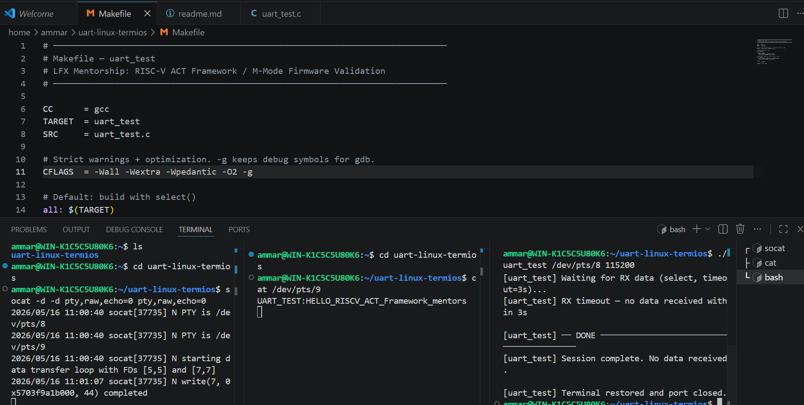

> **What this proves:** TX path works end-to-end. The "RX timeout" is correct and expected , it confirms `select()` is timing out cleanly rather than blocking forever.

---

### Test 2 — Message Received on the Other End

Shows the transmitted message arriving on Terminal 2 (`cat /dev/pts/9`), confirming bytes crossed the virtual serial link.

```bash
# Terminal 2
cat /dev/pts/9
```


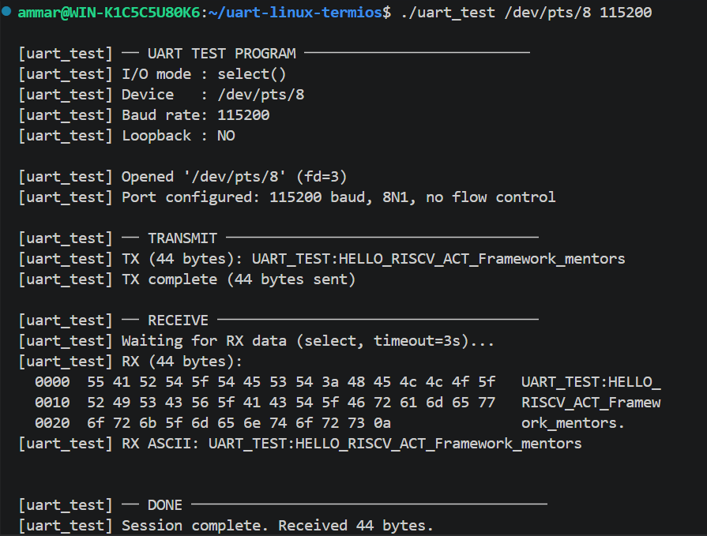

> **What this proves:** `UART_TEST:HELLO_RISCV_ACT_Framework_mentors` arrived intact on the other end of the virtual port pair.

---

### Test 3 — Loopback Self-Test (TX == RX)

Verifies that every byte sent comes back byte-for-byte identical. Uses `socat` to echo data from `pts/9` back to `pts/8`.

```bash
# Terminal 1
socat -d -d pty,raw,echo=0 pty,raw,echo=0

# Terminal 2 — echo pts/9 back to itself
socat /dev/pts/9 /dev/pts/9

# Terminal 3
./uart_test /dev/pts/8 115200 --loopback
```


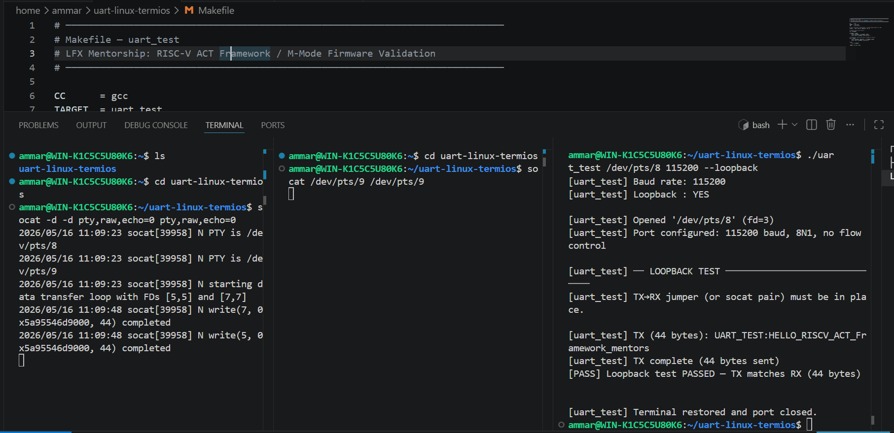

> **What this proves:** The loopback comparison logic works — 44 bytes sent, 44 bytes received, `memcmp()` passes.

---

### Test 4 — poll() Build Variant

Verifies the program compiles and behaves identically when built with `poll()` instead of `select()`.

```bash
make poll
./uart_test /dev/pts/8 115200
```

<!-- ADD SCREENSHOT: paste your poll() build output -->
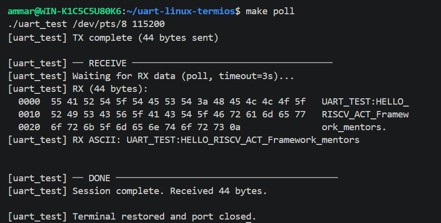

> **What this proves:** Both I/O multiplexing paths work. The only difference is the `I/O mode : poll()` line.

---

### Test 5 — Error Handling

The program catches all common failure modes and prints a clear, actionable error rather than crashing or hanging.

---

**Fake / non-existent device path:**
```bash
./uart_test /dev/ttyFAKE 115200
```

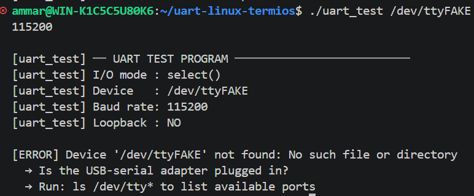

---

**Path exists but is not a serial device:**
```bash
./uart_test /etc/hostname 115200
```

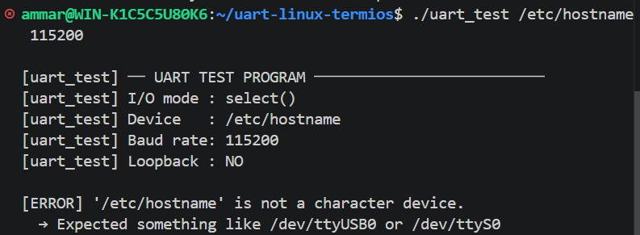

---

**Unsupported baud rate:**
```bash
./uart_test /dev/pts/8 99999
```

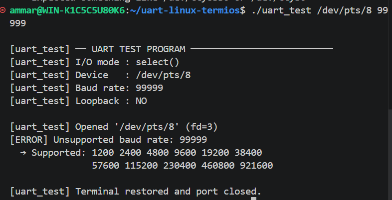

---

**No arguments supplied:**
```bash
./uart_test
```

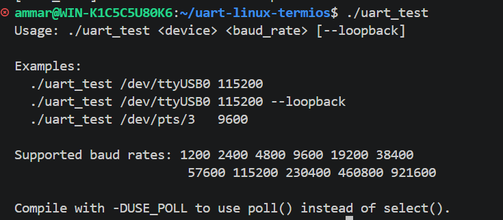

---

**Non-numeric baud rate:**
```bash
./uart_test /dev/pts/8 abc
```

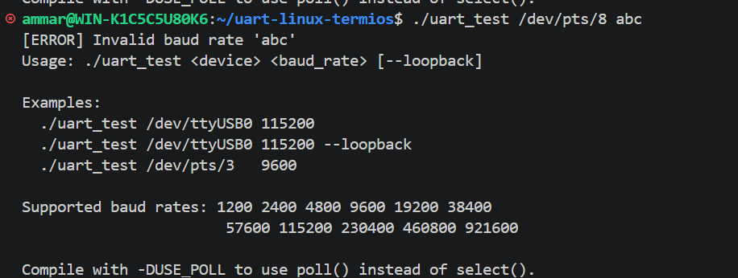

---

### Full Test Summary

| # | Test | Command | Expected Result | Status |
|---|---|---|---|---|
| 1 | Basic TX | `./uart_test /dev/pts/8 115200` | Message transmitted, RX timeout | ✅ Pass |
| 2 | RX on other end | `cat /dev/pts/9` | Message appears in cat output | ✅ Pass |
| 3 | Loopback | `./uart_test /dev/pts/8 115200 --loopback` | `[PASS] TX matches RX (44 bytes)` | ✅ Pass |
| 4 | poll() build | `make poll && ./uart_test /dev/pts/8 115200` | I/O mode shows `poll()` | ✅ Pass |
| 5 | Fake device | `./uart_test /dev/ttyFAKE 115200` | Device not found error | ✅ Pass |
| 6 | Not a device | `./uart_test /etc/hostname 115200` | Not a character device error | ✅ Pass |
| 7 | Bad baud rate | `./uart_test /dev/pts/8 99999` | Unsupported baud rate error | ✅ Pass |
| 8 | No args | `./uart_test` | Usage instructions printed | ✅ Pass |
| 9 | Alpha baud | `./uart_test /dev/pts/8 abc` | Invalid baud rate error | ✅ Pass |


---

## Common Errors & Fixes

| Error | Cause | Fix |
|---|---|---|
| `Permission denied: /dev/ttyUSB0` | Your user isn't in the `dialout` group | `sudo usermod -aG dialout $USER` then log out and back in |
| `Device not found: /dev/ttyUSB0` | USB adapter not plugged in | Check `ls /dev/tty*` after plugging in |
| `Not a character device` | Wrong path given | Use `ls /dev/ttyUSB*` or `ls /dev/ttyS*` to find the right one |
| `RX timeout — no data received` | Board not responding | Normal if nothing is connected; verify firmware is running |
| `Loopback test FAILED` | TX not connected to RX | Check the jumper wire between TX and RX pins on the header |

---

## Project Structure

```
uart_test/
├── uart_test.c        — Main source file
├── Makefile           — Build configuration
├── README.md          — This file
└── Diagrams/          — timing diagrams, terminal ouput

```

---

## How the Code is Organized

| Function | What it does |
|---|---|
| `main()` | Parses args, registers cleanup, calls everything in order |
| `open_uart()` | Validates the device path, opens it, switches to blocking mode |
| `configure_uart()` | Applies 8N1 settings, baud rate, and raw mode via termios |
| `transmit()` | Sends bytes with a retry loop for partial writes |
| `receive_select()` | Waits for data using `select()`, reads and prints it |
| `receive_poll()` | Same as above but using `poll()` (compiled with `make poll`) |
| `run_loopback_test()` | Sends a message and verifies the echo matches exactly |
| `hex_dump()` | Prints bytes as hex + ASCII side by side |
| `restore_terminal()` | Restores original port settings and closes the fd |
| `baud_to_speed()` | Converts integer baud rate (e.g. `115200`) to `speed_t` constant |

---

## Why select() and poll()?

Both `select()` and `poll()` solve the same problem: waiting for data to arrive without freezing the whole program. Instead of calling `read()` and blocking forever, we ask Linux "wake me up when data arrives or after N seconds, whichever comes first."

| | `select()` | `poll()` |
|---|---|---|
| Standard | POSIX, works everywhere | POSIX, slightly more modern |
| File descriptor limit | 1024 (hardcoded in kernel) | No limit |
| API style | Uses `fd_set` bitmask | Uses `pollfd` array |
| Best for | Simple tools like this | Servers with many connections |

For a UART test tool talking to one port, both work identically. The `USE_POLL` compile flag exists to show understanding of both.

---

## What is 8N1?

8N1 is the most common UART configuration. It means:

| Parameter | Value | Meaning |
|---|---|---|
| Data bits | **8** | Each frame carries 8 bits (one byte) |
| Parity | **N** (none) | No error-check bit added |
| Stop bits | **1** | One stop bit marks the end of a frame |

Almost every RISC-V development board defaults to 8N1 at 115200 baud.

---

## Cleanup — Why it matters on hardware

When this program exits — whether normally, due to an error, or from Ctrl+C — it always runs `restore_terminal()`. This function puts the serial port's settings back exactly as they were before the program touched them.

On RISC-V hardware this matters because other tools (`minicom`, `screen`, OpenOCD, the ACT framework itself) all share the same port. Leaving it in raw mode with wrong baud settings breaks every tool that runs after yours until the system reboots.

The cleanup is guaranteed by two mechanisms:
- `atexit(restore_terminal)` — runs on any normal or `exit()` call
- `signal(SIGINT, ...)` + `signal(SIGTERM, ...)` — catches Ctrl+C and kill commands

---

## License

MIT — free to use, modify, and distribute.

---

## Author

Ammarah Wakeel, LFX Mentorship Applicant, RISC-V ACT Framework Enablement and M-Mode Firmware Validation on Hardware Board

---

## Acknowlegement

I implemented this solution myself. I have worked with UART in embedded contexts on Tiva C, but the Linux termios API was new territory for me, so I used an LLM ( claude sonnet 4.6 ) at points to quickly look up specific flag meanings and API behaviour rather than spending time digging through man pages for every detail. The structure, the non-blocking I/O logic using select(), the error handling flow, and the overall design decisions are mine.
I am mentioning this because I think being upfront about tool use is the right thing to do, and honestly because in real firmware debugging on hardware like the Milk-V Jupiter, understanding what your code actually does matters more than where you first read about it. I made sure I understood every line before submitting.
